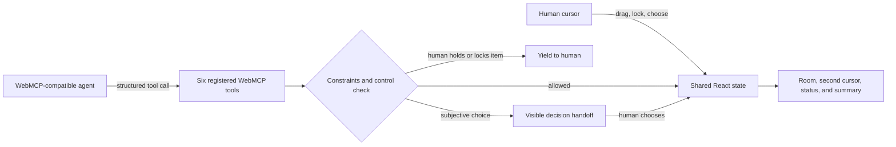

# Second Cursor: Moving Day — Project Record

This document is the durable completion record for **Second Cursor: Moving Day**, an individual submission to **The WebMCP Challenge**. It separates the product thesis, delivered implementation, verification evidence, submission facts, and possible future work.

## Project at a glance

| Item | Record |
| --- | --- |
| Status | Completed, published, and submitted |
| Completion date | August 30, 2026 |
| Challenge | The WebMCP Challenge |
| Submission type | Individual; new application |
| Devpost | [Second Cursor: Moving Day](https://devpost.com/software/second-cursor-moving-day) |
| Live application | [ChatGPT Sites deployment](https://second-cursor-moving-day.zzzzzzzzzz-phoebe.chatgpt.site) |
| Demo video | [68-second English demo](https://youtu.be/uYb1tT41l8g) |
| Public source | [GitHub repository](https://github.com/zzzzzzzzzzphoebe/second-cursor-moving-day) |
| License | [MIT](../LICENSE) |

## Core thesis

The traditional web assumes one cursor operated by one person. An agentic web introduces a second actor that can inspect, decide, and act. **Second Cursor** asks what the interface should become when both actors share the same live surface.

The answer is not to make the agent invisible. The human keeps the familiar white cursor, while the agent receives a visible blue cursor—an understandable, interruptible hand on the web. The interface discloses the agent's target, intent, progress, resulting change, active constraints, and control handoff.

This is **actionable disclosure**, not a representation of private chain-of-thought. Its purpose is to help people understand and govern agent actions without requiring them to supervise every low-level step.

The Moving Day room is a deliberately simple demonstration of a broader interaction model that could apply to design tools, spreadsheets, dashboards, editors, planning canvases, and other shared work surfaces.

## Product principles

1. **One workspace, two cursors.** The human and agent collaborate on the same visible object, not in disconnected chat and application contexts.
2. **The agent has a visible hand.** Its focus and action state are legible while work is happening, not only after the result appears.
3. **Human control is structural.** Human-held and human-locked objects cannot be overridden by the agent.
4. **Taste stays human.** When multiple valid outcomes depend on preference, the agent must ask instead of silently choosing.
5. **WebMCP is the capability boundary.** The page publishes explicit tools, schemas, and constraints that a compatible visiting agent can use; the experience is not tied to one hidden site-specific automation.
6. **Transparency serves action.** The product reveals operationally useful state while avoiding claims that it exposes private model reasoning.

## Delivered experience

- A responsive React and TypeScript room-arrangement application.
- A white human cursor and a blue agent cursor operating in one workspace.
- Direct human manipulation: drag, rotate, lock, and undo.
- Visible agent targeting, intent, progress, waiting state, changes, and completion summary.
- Human-priority interruption when a person takes hold of the same object.
- A decision handoff for subjective chair placement.
- A scripted **Play demo** fallback so the interaction can still be evaluated when WebMCP is unavailable in the current browser.
- Desktop and mobile visual evidence.
- A public deployment, public repository, English narrated video, and burned-in English subtitles.

## Interaction and architecture

The application uses React state and shared action handlers to synchronize furniture, locks, active human dragging, agent cursor movement, decisions, status messages, and completion state. WebMCP registrations use `document.modelContext.registerTool(...)`, JSON-schema inputs, bounded room coordinates, stable furniture identifiers, and abort-aware teardown.

Technology baseline at completion:

- React 19.2.8
- TypeScript 7.0.2
- Vinext 1.0.0-beta.8
- Vite 8.2.2
- Vitest 4.1.11 and Testing Library
- ChatGPT Sites hosting

## WebMCP capability surface

| Tool | Capability | Human-control behavior |
| --- | --- | --- |
| `inspect_room` | Reads furniture, coordinates, locks, room bounds, and layout constraints | Read-only |
| `point_out_issue` | Directs attention to a layout problem without modifying the room | Guidance only |
| `move_item` | Moves one furniture item to bounded coordinates | Rejects human-held or human-locked items |
| `rotate_item` | Rotates one furniture item | Rejects human-held or human-locked items |
| `request_choice` | Presents two valid options and waits for a human answer | Human makes the subjective decision |
| `finish_layout` | Ends the collaboration with a concise visible summary | Makes completion explicit |

## Verification record

The following checks were completed on August 30, 2026:

| Area | Result | Evidence |
| --- | --- | --- |
| Automated behavior | Passed, 3 tests | Shared-cursor rendering, decision handoff, and human locking |
| Production build | Passed | Vinext/Vite production build completed successfully |
| Public application | Passed | Live URL returned HTTP 200 |
| Public repository | Passed | `main` was synchronized with the public GitHub remote |
| WebMCP discovery | Passed | ChatGPT's in-app browser discovered all six tools on the deployed page |
| Live WebMCP invocation | Passed | `inspect_room` returned live furniture positions, human locks, room bounds, and constraints |
| Agent action | Passed | A live `move_item` invocation visibly moved the lamp during browser QA |
| Responsive presentation | Passed | Desktop and mobile implementation captures reviewed and retained |
| Demo package | Passed | Public 68.3-second, 1920×1080 English video with voice-over and burned-in captions |

The application and video release baseline is commit `1e69669f7a3220645a75822849ef8a2d7e5e4c87`. Subsequent commits refined public copy and the submission package without changing the core interaction model.

## Devpost submission record

| Field | Value |
| --- | --- |
| Project ID | `1407522` |
| Submission ID | `1161126` |
| State | `published` |
| Created | August 30, 2026 at 03:20:25 EDT |
| Submitted/published | August 30, 2026 at 03:21:23 EDT |
| Last submission-page update | August 30, 2026 at 03:32:59 EDT |
| Official submission deadline | September 3, 2026 at 1:00 PM PT / September 4 at 4:00 AM Taiwan time |

The published gallery contains three product images and the demo video. The recorded individual contribution is: “Concept, product design, WebMCP interaction model, implementation, testing, and demo production.”

## Artifact index

| Artifact | Location |
| --- | --- |
| Product overview and local setup | [README](../README.md) |
| Application source | [`src/`](../src) |
| WebMCP registrations | [`src/useWebMcp.ts`](../src/useWebMcp.ts) |
| Automated tests | [`src/App.test.tsx`](../src/App.test.tsx) |
| Submission narrative and form record | [`devpost-submission.md`](../devpost-submission.md) |
| Visual fidelity notes | [`design/fidelity-ledger.md`](../design/fidelity-ledger.md) |
| Desktop capture | [`design/implementation-desktop.png`](../design/implementation-desktop.png) |
| Mobile capture | [`design/implementation-mobile.png`](../design/implementation-mobile.png) |
| Social/gallery image | [`public/og.png`](../public/og.png) |
| Final video and production package | [`video/`](../video) |

## Important decisions

- **Moving Day was chosen as a legible demonstration, not the final market boundary.** Furniture makes shared targeting, protected objects, spatial constraints, interruption, and subjective choice immediately visible.
- **The second cursor became the product, not a decorative animation.** Every cursor state is tied to a real capability, constraint, waiting state, or handoff.
- **Transparency was framed narrowly and honestly.** The project communicates actionable state and never claims to reveal hidden chain-of-thought.
- **Human authority is enforced in code.** Locks, active dragging, and explicit choices are behavior rules rather than explanatory copy alone.
- **The page supplies capabilities; the visiting agent supplies intelligence.** This preserves the open WebMCP idea that compatible agents can operate the experience without a proprietary server-side model embedded in the site.
- **A fallback demo was retained for accessibility to judges.** It demonstrates the intended sequence but is clearly separate from a live agent invocation.

## Known limitations

- Live agent operation requires a client that exposes the current WebMCP API.
- The prototype covers one room-arrangement scenario rather than a general editor.
- State is local to the page session and has no backend persistence or multi-user synchronization.
- The scripted fallback demonstrates the flow but is not itself an AI agent.
- The visible agent cursor communicates actionable state, not private reasoning.

## Future directions — not committed scope

- Extract the second-cursor states and control contract into a reusable interaction pattern for other WebMCP applications.
- Test the same model in a spreadsheet, visual editor, or planning canvas where traceable agent changes have higher practical value.
- Add an inspectable action history with undo and per-action authorization levels.
- Explore multi-user and multi-agent presence without weakening ownership, interruption, and final-decision rules.
- Study whether consistent visual conventions for agent focus, waiting, blocked actions, and human takeover could become a broader design language for the agentic web.

## Final outcome

Second Cursor: Moving Day reached its intended competition milestone: a working WebMCP application, a clear interaction thesis, verifiable human-control behaviors, a public deployment, a public repository, a complete English demo video, and a published Devpost submission.

The enduring idea is larger than the room demo: **AI has entered the web. The second cursor is a first step toward giving it a visible hand—while keeping the human in control.**
